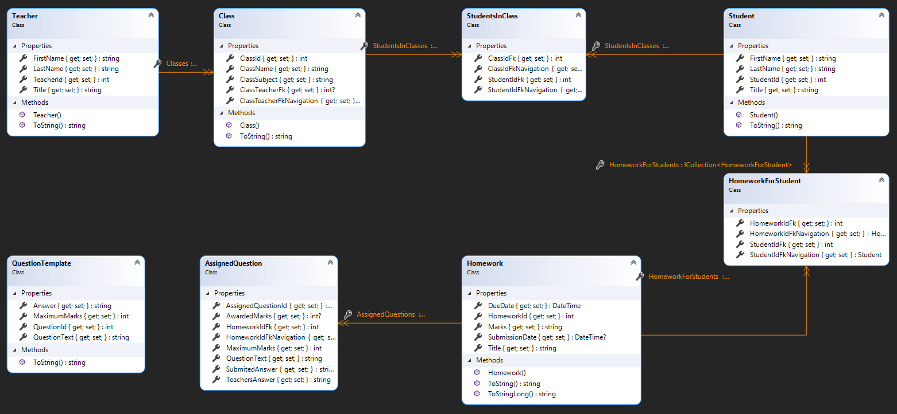
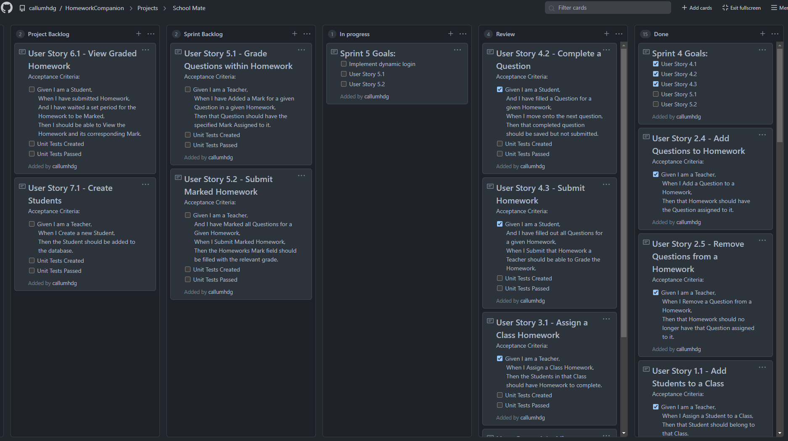

# Homework Companion
A C# app for teachers to allocate classes of students homework, a user guide can be found [here](User_Guide.md).

# ERD

# Project Goals

## Epics
1. As a Teacher I need to be able to Add Students to a Class.
2. As a Teacher I need to be able to Add Questions to Homework.
3. As a Teacher I need to be able to assign a Class Homework.
4. As a Student I need to be able to Complete and Submit Homework.
5. As a Teacher I need to be able to Grade Homework.
## Stretch Goals
6. As a Student I want to be able to View my Homework with marks.
7. As a Teacher I want to be able to Create Students.

   

   

# Sprints:

## Sprint 1 -

### Start:

This was the initial project backlog, the *Done* column and the *Notes* column have been swapped for this screenshot only.

**Sprint Goals:**

- [x] Project Initialisation 0.1
- [x] Project Initialisation 0.2
- [x] Project Initialisation 0.3
- [ ] User Story 2.1

### End:

### Retrospective:

The first sprint is usually the most challenging so I tried to aim for an achievable amount to complete; the sprint goals were to initialise the project and the database. Initialising the project went without a hitch but when writing the create statements for the database it became apparent that another link table was needed. 

One thing that I would do differently next time would be to not create the ERD until the backlog is well populated, this resulted in me planning ideas that were too specific instead of planning more general ideas of what needs to be done.

Another improvement would be to add a bit more than I think can be done this sprint because I aimed too small I had to add another user story into the sprint goals.

## Sprint 2 -

### Start:

**Sprint Goals:**

- [x] Utilities login

- [x] User Story 1.1
- [x] User Story 1.2
- [x] User Story 2.1
- [x] User Story 2.2
- [x] User Story 2.3
- [ ] User Story 3.1

### End:

### Retrospective:

This sprint went well overall, I set a lot of work to be completed including some stretch goals. The login isn't really a login yet because it isn't as valuable to the project as having something that works. Students can be added to a class and removed from it but there is an issue with the refresh that I mistook for a bug, the listboxes are updated quicker than the database can be referenced and adding a one second pause did not resolve the issue.

User story 3.1 was ambitious for this sprint and subsequently was not achieved but a good amount of functionality was added.

The `SelectAllStudentsInAClass()` and `SelectAllStudentsNotInAClass()` were only manually tested for now but I plan to write unit tests for these methods later.

## Sprint3 -

### Start:

**Sprint Goals:**

- [x] User Story 1 - Add Class Select
- [x] User Story 2.4
- [x] User Story 2.5
- [x] User Story 3.1
- [ ] User Story 4.1

### End:

### Retrospective:

Sprint 3 went well, in this sprint I implemented user story 3.1 *Assign a Class Homework* which was likely the biggest single user story in the project. Another positive was fixing the class view, now teachers can only view classes that they teach also, when adding or removing students to/from a class the listboxes now display correctly.

## Sprint 4 -

### Start:

**Sprint Goals:**

- [x] User Story 4.1
- [x] User Story 4.2
- [x] User Story 4.3
- [ ] User Story 5.1
- [ ] User Story 5.2

### End:

### Retrospective:

This sprint went wall overall but I would have liked to complete more functionality. An unexpected blocker was having to learn how to pass data between windows and pages but now I know how I will focus on a better login in the next sprint, not a username and password login but selecting the user from a listbox. After the login has been improved there isn't a lot left before completing the MVP.

## Sprint 5 -

### Start:

This sprint lasted Saturday and Sunday because neither day was a full day worth of work so this one sprint was two half days.

**Sprint Goals:**

- [x] Implement dynamic login
- [x] User Story 5.1
- [x] User Story 5.2

### End:

### Retrospective:

This sprint was less organised than the other sprints due to it being on a busy weekend but the sprint was still complete which leaves only stretch goals. One design flaw was noticed though, the Homework table should have a column for a foreign key link to the class it was assigned from, If there is time in the next sprint this will be fixed.

