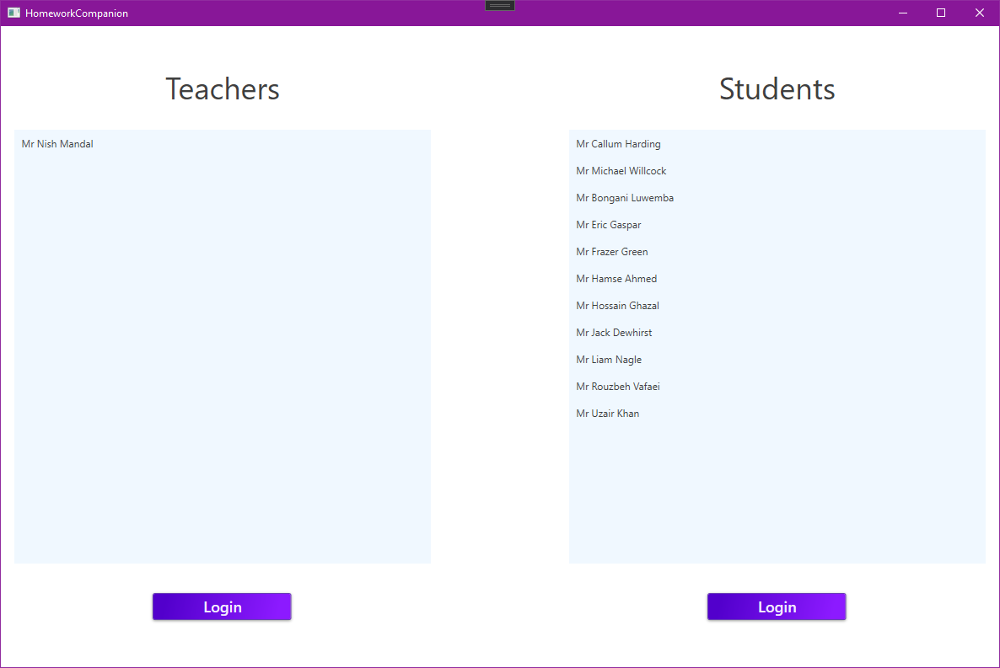
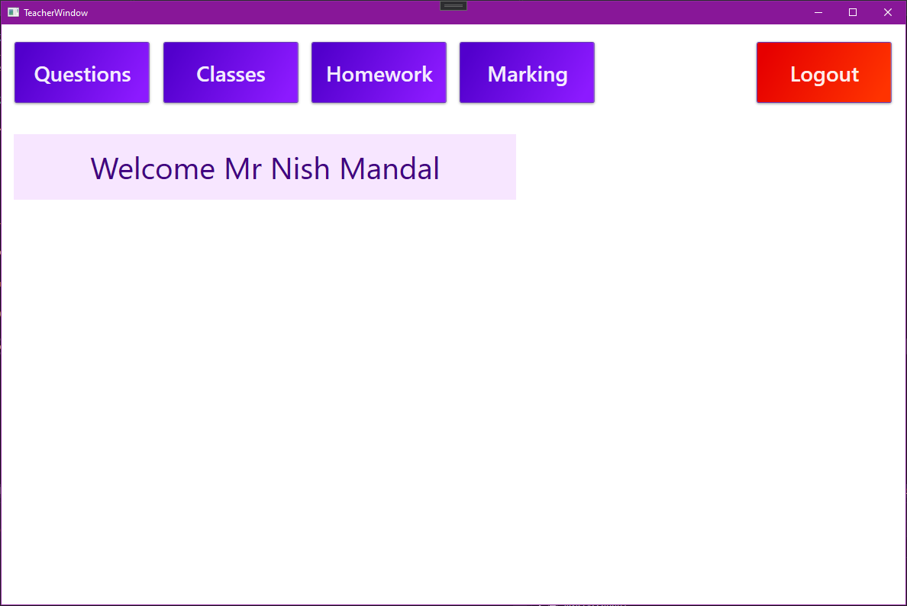
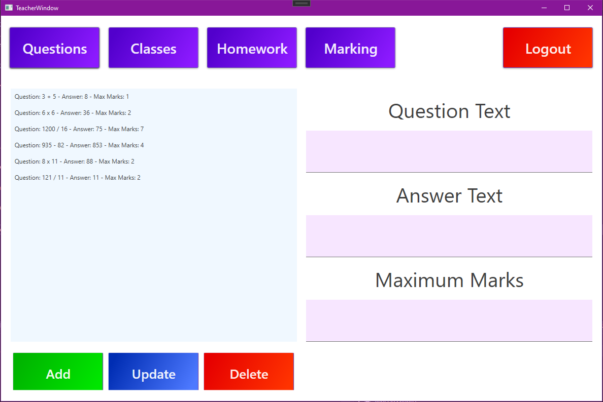
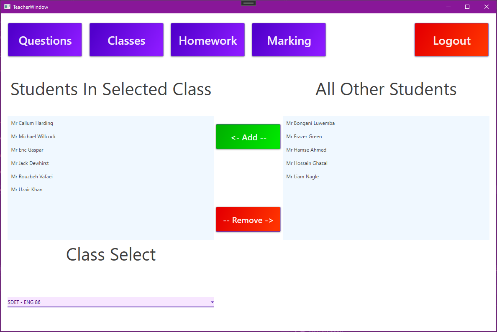
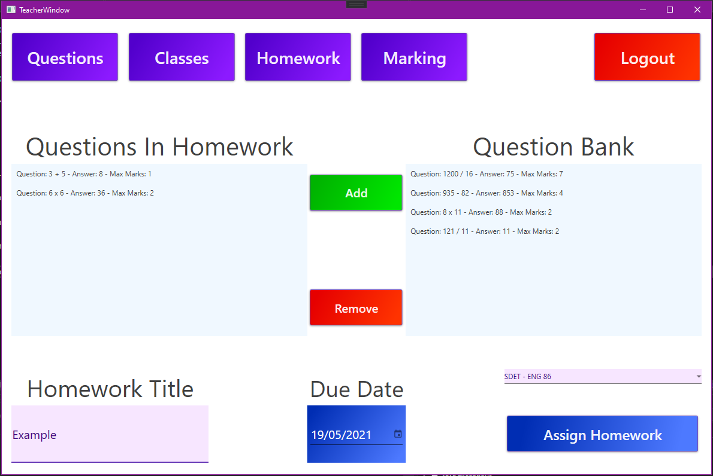
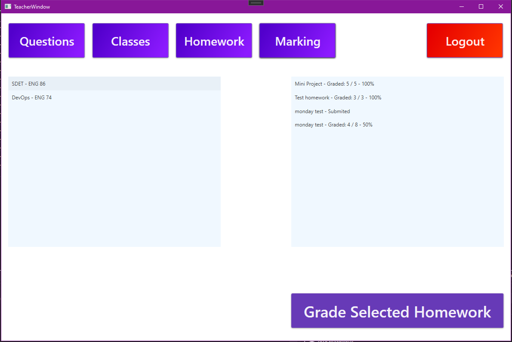
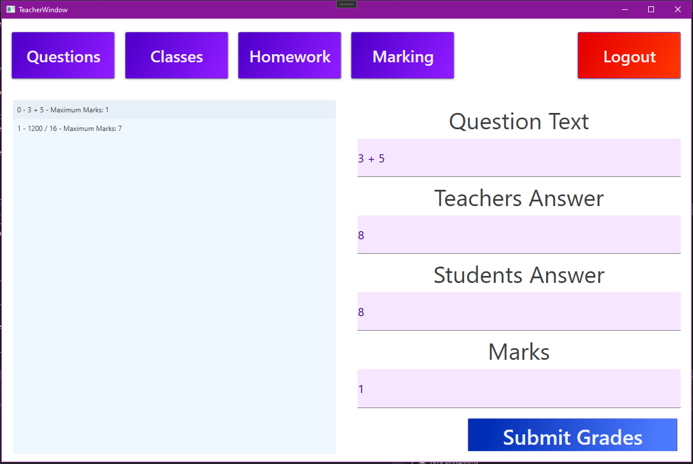
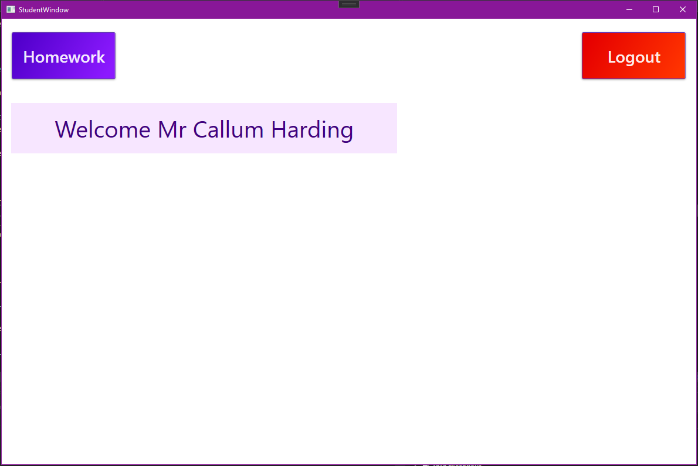
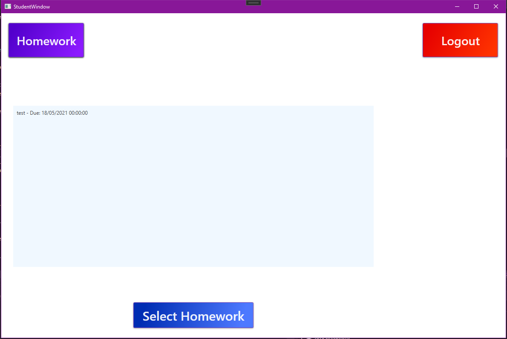
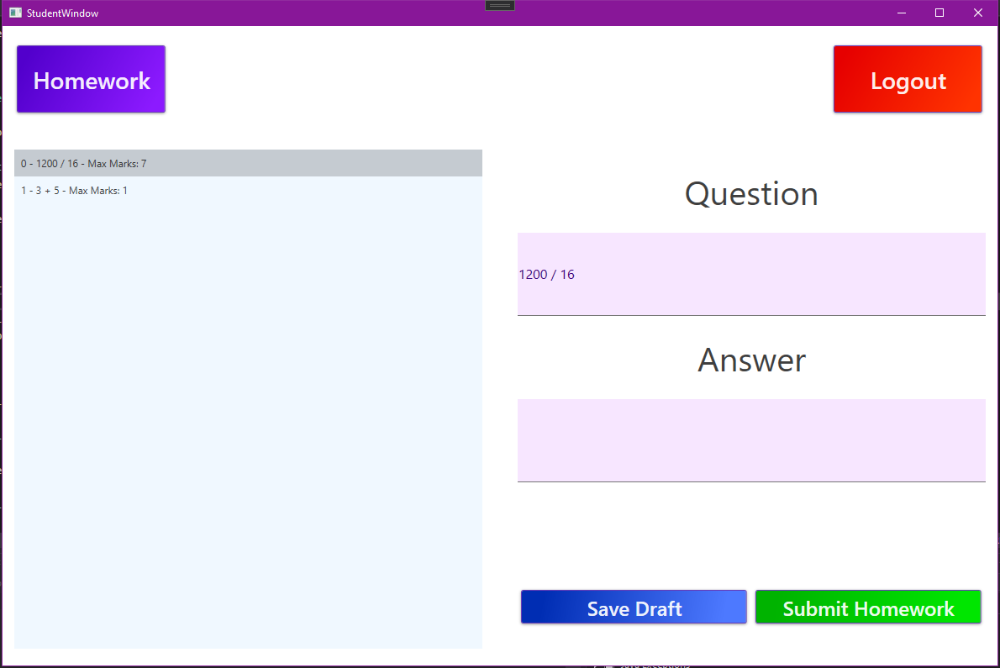

# User Guide

## Login

The login page consists of two lists and two buttons. On the left a teacher can be selected and the left login button can be used to login as the selected teacher. On the right a student can be selected and the right login button can be used to login as the selected student.

## Teacher

This is the Teacher Home Page, from here the user can navigate to; the Questions Page, the Classes Page, the Homework Assignment Page, The Marking Page or Logout and return to the [Login Page](#Login)

### Questions Page

The questions page allows a teacher to; create, read, update and delete question templates.

### Classes Page

The classes page allows teachers to select a class that they are assigned to, then add or remove students within that class.

### Homework Assignment Page

The homework assignment page allows a teacher to select questions from the question bank to add to the homework being assigned. When assigning homework a class must be selected from the list of classes that the logged in teachers classes, a title for the homework must be added and a due date for the homework is required.

### Select Homework For Marking Page

This page allows the teacher to select a class and view all homework for that class post due date. Selecting a homework and clicking 'Grade Selected Homework' will redirect the teacher to the [Assign Marks Page](#Assign Marks Page).

### Assign Marks Page

This page allows the teacher to assign marks to a students homework. When 'Submit Grades' is clicked the marks are submitted and the grade is calculated, any unmarked questions will be marked as 0 and if more marks are given than the maximum marks allows then the maximum marks are achieved but no higher.

## Student

This is the homepage for students, here they can [logout](#Login) or [view their homework](#View Assigned Homework Page).

### View Assigned Homework Page

This page allows students to view their current homework, that is homework that is due in the future and not submitted. Selecting a homework from the listbox and clicking the 'Select Homework' button at the bottom of the page will direct the student to the [Complete Homework Page](#Complete Homework Page) for the corresponding homework.

### Complete Homework Page

Here the student can add answers to the homework they selected. The 'Save Draft' button will save all current answers but not submit the homework allowing the student to complete the homework at a later date whilst keeping their progress. The 'Submit Homework' button saves all answers and submits the homework, this removes access to this homework for the student but will appear as 'Submitted' to the teacher when the due date has passed and the teacher goes to mark the homework.
